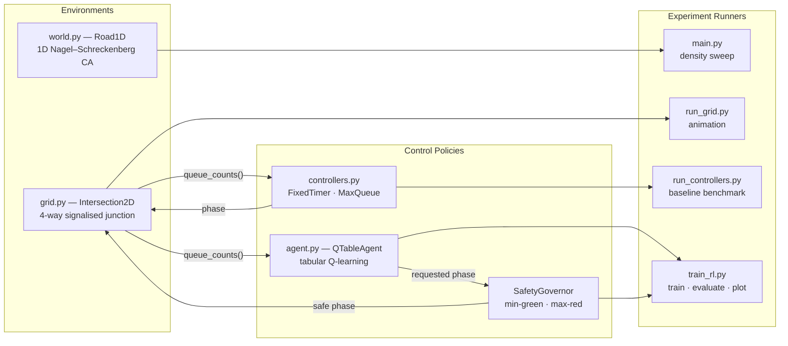
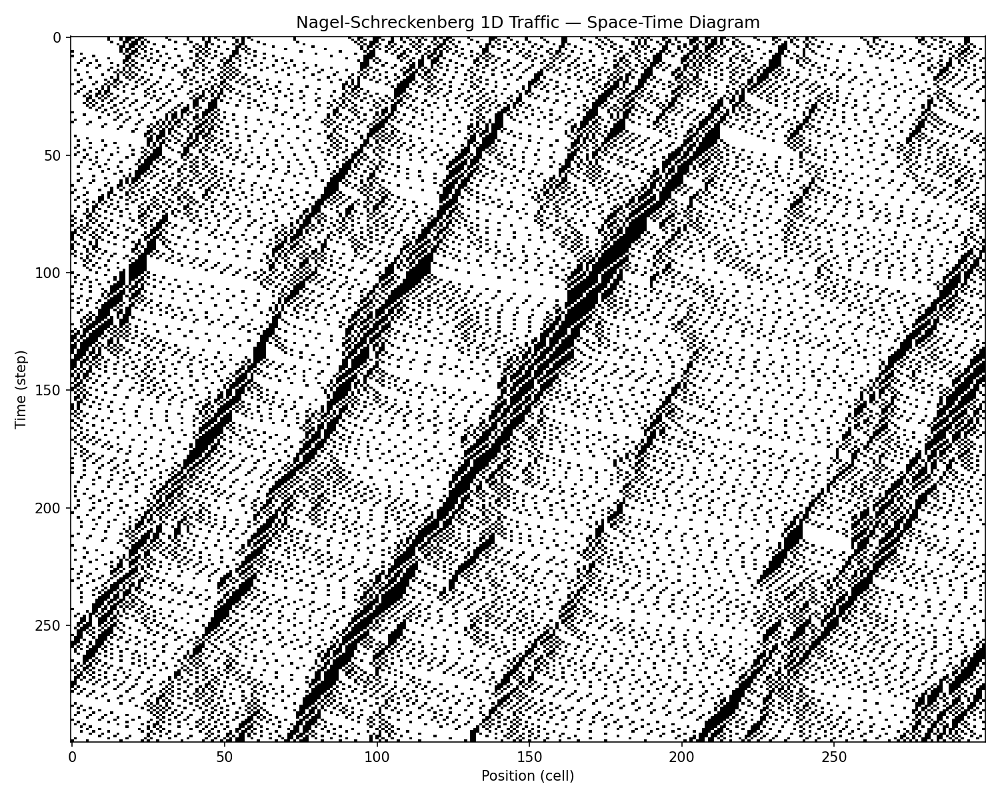
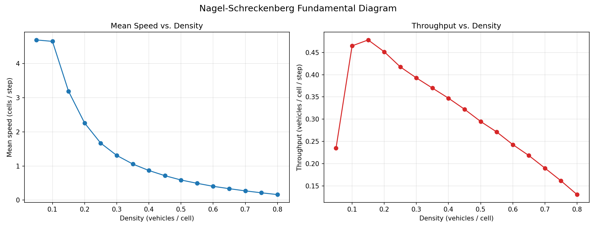
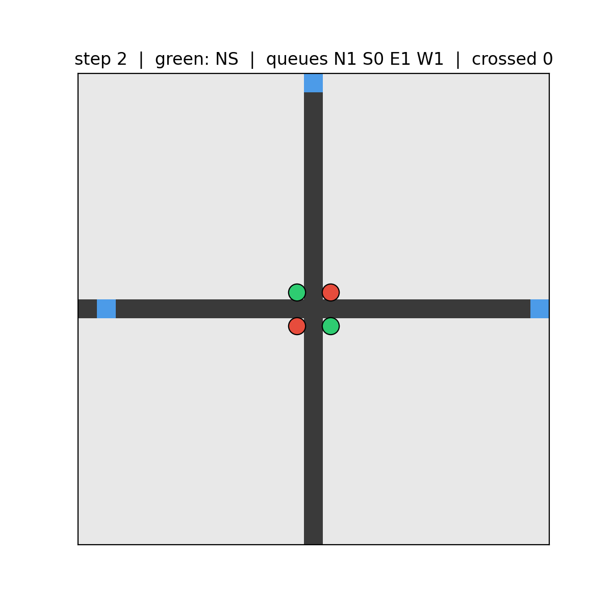
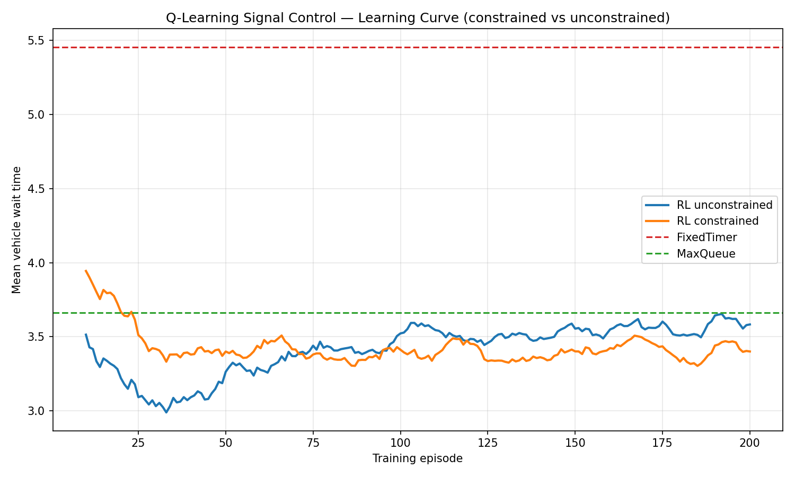

# 🚦 traffic-simulation-rl

A from-scratch traffic-simulation and reinforcement-learning sandbox: cellular-automata
traffic models, a signalised intersection environment, classical control baselines, and a
**safety-constrained Q-learning** signal controller — benchmarked end-to-end.

Everything is pure **NumPy + Matplotlib** (no RL frameworks), so every moving part is
inspectable.

---

## Table of Contents
- [Architectural Overview](#architectural-overview)
- [Visual Results](#visual-results)
- [Benchmark: Controller Comparison](#benchmark-controller-comparison)
- [Quickstart](#quickstart)
- [Module Reference](#module-reference)
- [Sim-to-Real Deployment Challenges](#sim-to-real-deployment-challenges)

---

## Architectural Overview

The project is layered into **environments**, **control policies**, and **experiment
runners**. The RL agent and the baselines share a single interface with the intersection
environment — they observe queue counts and return a green-phase action — which makes them
directly comparable.



**Two modelling scales.** `Road1D` is a microscopic-but-macroscopic 1D highway used to
reproduce the classic *fundamental diagram* of traffic flow. `Intersection2D` is the
control testbed: four single-lane approaches, two signal phases (North–South / East–West),
stochastic arrivals, and per-vehicle wait accounting.

**Control stack.** Two hand-written baselines (`FixedTimer`, `MaxQueue`) establish the bar.
The `QTableAgent` learns a phase-switching policy from a reward equal to the negative
waiting time. A `SafetyGovernor` sits between agent and environment as an **action shield**,
enforcing legally-relevant timing constraints regardless of what the policy requests.

---

## Visual Results

### 1D traffic — space-time diagram (`spacetime.png`)
Diagonal streaks are free-flowing vehicles; the dark bands are spontaneous "phantom" jams
that the Nagel–Schreckenberg model produces without any bottleneck.



### Fundamental diagram — density sweep (`congestion_curve.png`)
Mean speed decays monotonically with density, while throughput rises to a capacity peak
(~ρ = 0.10–0.15) and then collapses into congestion.



### Signalised intersection — animation (`intersection.gif`)
A fixed-time controller cycling NS/EW green; queues build on the red approaches and drain
on green.



### RL learning curve (`rl_learning_curve.png`)
Mean vehicle wait per training episode for the constrained and unconstrained agents, with
the two baselines as dashed references.



---

## Benchmark: Controller Comparison

All four controllers evaluated on the **same held-out test seeds** `(0, 1, 2)`, 1,000 steps
each, `arm_length = 12`, `p_arrival = 0.4`. Wait times are per-vehicle, in simulation steps
(**lower is better**).

| Controller           | Mean Wait | p95 Wait | Notes                                             |
|----------------------|:---------:|:--------:|---------------------------------------------------|
| FixedTimer           |   5.455   |  12.000  | Traffic-blind fixed schedule (the bar to beat)    |
| RL — unconstrained   |   3.704   |  11.000  | Learns to serve demand; ragged worst-case tail    |
| **RL — constrained** | **3.704** | **9.000**| **min-green 5 / max-red 30 — best of both**       |
| MaxQueue             |   3.661   |   9.000  | Strong greedy heuristic (serve the longest queue) |

**Key finding.** The safety constraints cost **nothing** on the mean (3.704 → 3.704) yet cut
the **p95 tail from 11 → 9 steps**. The `max-red` lockout prevents any approach from being
starved, eliminating the rare long-wait events — so the constrained agent is *strictly safer
with no efficiency penalty*, matching MaxQueue's tail behaviour. Enforcing timing safety
reduced worst-case wait by ~18% at no cost to average throughput.

> Reproduce with `python train_rl.py`. Baseline-only numbers: `python run_controllers.py`.

---

## Quickstart

```bash
# dependencies
pip install numpy matplotlib pillow

# 1D highway: density sweep -> congestion_curve.png
python main.py

# intersection animation -> intersection.gif
python run_grid.py

# baseline controller benchmark (prints table)
python run_controllers.py

# train the RL agent + safety layer, evaluate, plot -> rl_learning_curve.png
python train_rl.py
```

---

## Module Reference

| File                 | Contents                                                                              |
|----------------------|---------------------------------------------------------------------------------------|
| `world.py`           | `Road1D` — 1D Nagel–Schreckenberg cellular automaton with periodic boundaries         |
| `main.py`            | Density sweep producing the fundamental diagram                                       |
| `grid.py`            | `Intersection2D` — 4-way signalised junction, queue counts, per-vehicle wait tracking |
| `run_grid.py`        | Renders the intersection to an animated GIF                                            |
| `controllers.py`     | `FixedTimerController`, `MaxQueueController` baselines                                 |
| `run_controllers.py` | Benchmarks the baselines across seeds                                                 |
| `agent.py`           | `QTableAgent` — tabular Q-learning over bucketised queue states                       |
| `train_rl.py`        | `SafetyGovernor` + training/evaluation pipeline and learning-curve plot               |

---

## Sim-to-Real Deployment Challenges

This simulator is a deliberately clean abstraction. Moving a learned signal controller onto
real hardware surfaces a set of hard problems that the sandbox does **not** yet model:

**1. The reality gap.** `Intersection2D` uses unit cells, deterministic single-cell motion,
and Poisson arrivals. Real traffic has heterogeneous vehicles, acceleration/braking
dynamics, turning movements, lane changes, pedestrians, and cyclists. A policy overfit to
the idealised dynamics can behave unpredictably when the transition model differs. The
standard mitigation is a **calibrated microscopic simulator** (SUMO, Vissim, Aimsun) tuned
to real detector data, used as an intermediate training ground.

**2. Partial observability and sensor noise.** The agent here reads exact queue counts. In
the field, state comes from inductive-loop detectors, radar, or cameras — all of which are
**noisy, delayed, and occasionally offline**. Coarse bucketisation helps robustness, but a
deployable controller must tolerate missing/degraded observations and estimate state
(e.g. Kalman filtering or learned state estimators) rather than assume ground truth.

**3. Non-stationarity.** Demand is not fixed: rush-hour peaks, weekends, weather, incidents,
and special events all shift the arrival distribution. A frozen Q-table trained on one
regime degrades under distribution shift. Real deployments need **online adaptation**,
periodic retraining, or context-conditioned policies — plus monitoring to detect drift.

**4. Safety is a hard constraint, not a learned preference.** Real signals must guarantee
minimum-green, maximum-red, and **yellow + all-red clearance intervals** for legal and
physical safety — a learned policy may not be trusted to discover these. The `SafetyGovernor`
is a first step toward **action shielding**: the policy proposes, an independent verified
layer disposes. Production systems formalise this with runtime assurance / provable shields
so that *no* agent output can violate the constraints.

**5. Reward mis-specification.** Minimising vehicle wait can conflict with objectives a city
actually cares about: pedestrian service, emissions, fairness across approaches, transit
priority, and coordination with neighbours. A single scalar reward invites reward hacking
(e.g. starving a low-volume approach). Deployment needs **multi-objective** shaping and
explicit fairness/priority terms.

**6. Scalability and coordination.** Tabular Q-learning over one junction does not scale to a
city. Networks require function approximation (DQN and successors) and **multi-agent
coordination** to produce green waves rather than locally-greedy, globally-poor behaviour.
State/action spaces explode, and credit assignment across intersections is non-trivial.

**7. Latency, hardware, and integration.** Signal controllers run on fixed cycle timings and
must interface with legacy controller cabinets and standards (NTCIP). Decision latency,
actuation constraints, and fail-safe fallback to fixed-time operation on controller fault
all constrain what a learned policy may do.

**8. Validation and rollout.** Before touching live traffic, a controller is vetted in
**shadow mode** (logging decisions without actuating), then hardware-in-the-loop against a
digital twin, then limited field trials with human oversight and instant rollback — under
regulatory approval and with cybersecurity hardening against adversarial inputs.

**Bottom line:** the results above are meaningful *within the model*. The engineering path to
the street is dominated by observability, non-stationarity, and **provable safety** — which
is why the safety layer, not the raw reward, is the most deployment-relevant piece here.
